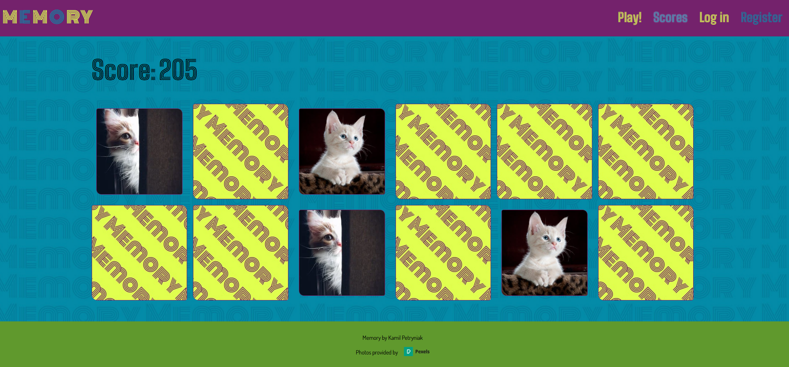

# Memory - card game webapp

Simple web app - browser based game created with HTML, CSS, Python, Node.js and Sqlite or Postgres. By using "Pexels" API it lets you play card game, where you look for matching pairs.

#### Table of contents

- [Video Demo](#video-demo)
- [Description](#description)
- [Technologies](#technologies)
- [Features](#features)
- [Files](#files)
- [Setup](#setup)

#### Video Demo <URL: https://youtu.be/RBGItvYAfps>

#### Description

This is a final project for Harvard's CS50 course. My goal was to use new learned technologies, memorize the material from course and have fun while doing it.
"Memory" is a web application - browser based game card game. The rules are simple: you are flipping the cards in search of matching pairs. At the beginning of the game user can choose the amount of cards and type his own "game theme" in which cards-images will be displayed. To achieve customized game-theme app uses image stock API from Pexels on the backend. After the game we can check the images once more, see originals, author name and add them to our favorites list, by liking them. In game we also keep score, taking into account how fast you were and how many consecutive match you got. Top scores are displayed in separate tab, so we can compete between other users.

#### Technologies

Project is created with:

- Python 3.8.10
- Flask
- SQLite or Postgres - user can decide
- CSS
- HTML

Libraries:

- sqlite3
- flask
- flask_session
- requests

Projects uses image stock API:

- Pexels <URL: https://www.pexels.com/api/documentation/>

#### Features

- Register users
- Choose with how many cards you will play
- Choose your own game theme in which pictures from Pexels API will be displayed
- Save favourites images
- Delete images from favourites
- Record user score (if logged in)
- Record TOP 10 scores of the user
- Show TOP SCORES board of all users
- Choose database in app.py file: Postgres or Sqlite

#### Files

###### app.py

File containing all app functionalities from a back-end site. Written with Pythons Flask.

- Choose type of databse that app will use: Postgres or Sqlite
- Renders HTML templates
- Recives score after the game and saves it in the Sqlite databse
- Reads scores from database and renders in the HTML template
- Recives liked photo link and saves it in the database
- Deletes favourite pictures from database
- Register user
- Logs user in and out
- Renders yousers account template (his scores and favourite pictures)
- Specify users game (card amount and theme)
- Gets images from API and sends it to game template

###### helpers.py

Contains helping functions used in app.py. Contains function that:

- Fetches photos from Pexels API
- Decorate routes to require login, from: <URL: https://flask.palletsprojects.com/en/1.1.x/patterns/viewdecorators/>
- Returns apology and error code, if occured
- Returns username, if logged in

###### memory.db

Database in sqlite3.

###### /static

Folder containing static files:

- Images - backup images in case of API not responding
- Background image
- Icon
- Custom CSS

###### /static/scripts

Folder contains javascript files with logic of the game.

###### /templates

Folder containing HTML templates.

- game.html renders the actual card game and imgages that was used in it. Contains javascript functions that:

* recives data from Flask and translates it to javascript
* flips card and replece image with the one from Pexels API
* checks for match and records it
* keeps score
* counts bonus points
* renders after game screen
* shows cards used in game
* adds photos to favourites

- index.html renders homepage
- layout.html layout for other templates
- login.html log user in
- myaccount.html shows logged users his scores and images added to his favourites. With help of javascript user can delete photos.
- register.html register user
- scores.html shows table with best scores of all users
- sorry.html template used to show error message and code
- specify.html lets user specify the game

#### Setup

1. Change ".env_YOUR_SETTINGS" name to ".env".

2. Update variables. You need to register on Pexels developer website to get API key (for free).
   [Pexels API link](https://www.pexels.com/api/)

3. To run this project, open its directory and run flask web server.

```
cd ../memory
python3 -m flask run
```
